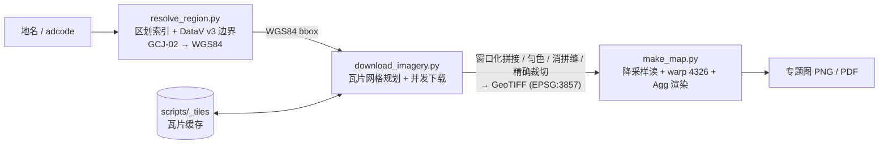

# cn-satellite-imagery

> 输入一个中国区县名或 6 位 adcode，自动下载卫星影像、拼接成带地理参考的 GeoTIFF，
> 并可一键生成 ArcGIS 风格的遥感影像专题地图（比例尺 / 指北针 / 经纬网 / 图例 / 区界红线）。
>
> 既是 WorkBuddy Skill（见 `SKILL.md`），也可当作独立命令行工具使用。

- **影像源**：Esri World Imagery（默认，国内可直连）、Google Satellite（可扩展）
- **范围约束**：仅支持**区县级及以下**；省 / 地级市会被硬拒绝并列出其下辖区县
- **产物**：GeoTIFF（EPSG:3857 / 可选 EPSG:4326）+ 专题地图 PNG / PDF，均写入血缘元数据

---

## 特性

| 能力 | 说明 |
|---|---|
| 地名解析 | 区划索引（china-division）+ DataV v3 边界；`GCJ-02 → WGS84` 反算，与 Esri 底图对齐 |
| 同名消歧 | 命中多个候选时列出并要求 `--parent` 或直接用 adcode，**不静默选错** |
| 并发下载 | 请求连接池 + 多线程 + 本地瓦片缓存；超时 / 重试 / 坏缓存自动重下 |
| 安全护栏 | 瓦片数上限（默认 60000）、`--dry-run` 预检（张数 / 块尺寸 / 像元体量） |
| 拼接 | **窗口化写入，内存与面积解耦**；匀色（`none` / `offset` / `percentile`）、消拼缝（feather）、失败瓦片空洞填充 |
| 输出 TIF | JPEG q90 + tiled 256 + 金字塔概览，体积约为无压缩的 **1/9**；裁切 / 重投影保留创建选项 |
| 专题制图 | 图示比例尺（**WGS84 椭球真值**）、罗盘指北针、DMS 经纬网、图例、研究区区界红线、数据来源注记 |
| 版式稳健 | 四角装饰件位置固定 + 白色衬底面板（区界线穿到卡片处被压住）；面板尺寸与字号**由实测文字宽度反推** |
| 血缘元数据 | 每张产物记录 `skill_version` / `source` / `region_name` / `adcode` / `zoom` / `bbox_wgs84` / `failed_tiles` / `blank_tiles` / `filled_holes` … |

## 快速开始

### 安装依赖

```bash
pip install rasterio matplotlib numpy pillow requests mercantile
```

> Windows 上 `rasterio` 的 wheel 已自带 GDAL，无需单独安装。

### 三条命令

```bash
# 1) 地名 → 影像（默认 zoom=17、EPSG:3857、消拼缝开启）
python scripts/satellite_imagery_cn.py 包河区

# 2) 一键出专题地图
python scripts/satellite_imagery_cn.py 包河区 --map --title "包河区遥感影像专题图" --map-dpi 300

# 3) 已有 TIF，只重出图（改标题 / 图例位置不用重下影像）
python scripts/make_map.py 包河区_satellite_z17.tif --output 包河区_专题图.png
```

### 常见用法

```bash
# 18 级 / adcode / 指定输出
python scripts/satellite_imagery_cn.py 包河区 --zoom 18
python scripts/satellite_imagery_cn.py 340111 --output d:/img/baohe.tif

# 同名区划消歧（如「朝阳区」）
python scripts/satellite_imagery_cn.py 朝阳区 --parent 长春市

# 重投影到 WGS84，便于与 DEM 叠加
python scripts/satellite_imagery_cn.py 包河区 --epsg 4326

# 只预检不下载
python scripts/satellite_imagery_cn.py 包河区 --zoom 17 --dry-run

# 内存紧张：调小预算自动走流式
python scripts/satellite_imagery_cn.py 包河区 --mem-budget-mb 512

# 自定义范围（bbox 模式不受区县级护栏限制）
python scripts/download_imagery.py --bbox "117.2,31.8,117.45,32.05" --zoom 16 --output x.tif
```

## 架构与数据流



| 脚本 | 职责 |
|---|---|
| `scripts/satellite_imagery_cn.py` | 一键入口：解析地名 → 下载 → 写血缘元数据 →（可选）出专题图 |
| `scripts/resolve_region.py` | 地名 / adcode → WGS84 bbox（区划索引 + DataV v3 边界，GCJ-02→WGS84） |
| `scripts/download_imagery.py` | bbox + zoom → GeoTIFF（窗口化落盘、匀色 / 消拼缝 / 多源 / 重投影） |
| `scripts/make_map.py` | GeoTIFF → ArcGIS 风格专题图 PNG / PDF（自动注册系统 CJK 字体） |

## 输出规格

| 项 | 值 |
|---|---|
| 坐标系 | `EPSG:3857` 默认；`--epsg 4326` 可选（与 DEM 叠加对齐） |
| 波段 | 3（RGB）uint8 |
| 压缩 | JPEG（YCbCr）+ tiled 256×256 + 金字塔概览（按尺寸自适应） |
| 地理参考 | 完整（精确裁切到请求 bbox） |
| 元数据 | `skill_version` / `source` / `region_name` / `adcode` / `admin_level` / `zoom` / `bbox_wgs84` / `generated_at` / `failed_tiles` / `blank_tiles` |
| 命名 | `<区划名>_satellite_z<zoom>.tif` |

## 常用参数

| 参数 | 默认 | 说明 |
|---|---|---|
| `--zoom` | `17` | 最高 18；z19 需 `--force` |
| `--epsg` | `3857` | `4326` 重投影 WGS84 |
| `--parent` | — | 同名区划消歧 |
| `--pad` | `0.10` | 下载范围相对行政区包围盒外扩比例（研究区留白） |
| `--source` | `esri` | `google` 需代理 / 境外 |
| `--balance-mode` | `none` | `offset` 仅中位数亮度偏移 / `percentile` 5–95% 拉伸 |
| `--feather` | `24`（bbox 模式 `0`） | 消拼缝像素宽，建议 16–32 |
| `--max-workers` | `12` | 并发下载线程数 |
| `--mem-budget-mb` | `2048` | 超出自动转流式 |
| `--dry-run` | off | 只预检不下载 |
| `--map` / `--title` / `--map-dpi` | off / 元数据区名 / `200` | 专题图开关、标题、分辨率 |
| `--boundary` / `--no-boundary` | 本区县边界 / off | 研究区红线 |
| `--legend-pos` | `se` | `se` 固定右下角；`auto` 按区界压力自动避让；或 `sw/ne/nw/e/w/s/n` |
| `--panel-alpha` | `1.0` | 比例尺 / 图例衬底不透明度（`0` = 不要面板） |
| `--version` | — | 三个入口均支持 |

> 完整参数表（含适用入口）见 [`references/params.md`](references/params.md)。

## 性能

所有数字均为**微基准实测**，不是估计值。测试环境：Windows / 20 逻辑核。

### 出图链路分解（`make_map()` 内部，热页缓存）

| 阶段 | 耗时 | 占比 |
|---|---|---|
| 读图（average 降采样读 + 多线程重投影） | ~450 ms | 27% |
| `_render_map_core`（**全部**装饰件） | 50 ms | **3%** |
| Agg 光栅化 | ~600 ms | 36% |
| PNG 编码 | ~310 ms | 19% |
| 其余（figure 构建 / 版式计算 / 文字实测） | ~230 ms | 14% |
| **合计** | **1644 ms** | 100% |

> 以独立进程（CLI）运行再另加解释器与依赖导入约 0.7 s，故命令行自报「用时 2.0 s」。
> 关键结论：**装饰件的绘制成本可以忽略（3%）** —— 想提速只有「读图 / 渲染 / 存盘」几条路，
> 改比例尺、图例、标题的版式代码不会让出图变快。

### 已落地的优化

| 版本 | 优化 | 前 | 后 | 提升 | 代价 |
|---|---|---|---|---|---|
| v1.7.8 | 降采样读的重采样核 `bilinear` → `average` | 1420 ms | 1004 ms | **1.41×** | 像素差 mean 0.31/255；且 `average` 是降采样的正确抗混叠核 |
| v1.7.8 | PNG 存盘 zlib 级别 6 → 3 | 1123 ms | 1002 ms | **1.21×** | 体积不变、逐像素差 0 |
| v1.7.9 | GDAL warp 多线程（`num_threads=8`） | 387 ms | 107 ms | **3.6×** | **逐像素 max\|Δ\| = 0** |
| v1.7.9 | 同上，作用于整幅 `--epsg 4326` 重投影 | 53.3 s | 24.9 s | **2.14×** | 同上 |

**端到端**（同口径微基准，`make_map()` 内部）：**2.20 s → 1.64 s（−25%）**；
`--epsg 4326` 整幅重投影 **省约 28 s**。两轮优化后的产物与优化前**逐像素完全一致**（`max|Δ| = 0`）。

### 评估后放弃的优化（有数据才敢放弃）

| 候选 | 实测 | 放弃理由 |
|---|---|---|
| warp 线程数提到 16 | 8 线程 25.4 s → 16 线程 **33.0 s** | **反而更慢**（超额订阅争抢），8 是拐点 |
| 用 `GDAL_NUM_THREADS` / `rasterio.Env` 提速 warp | 1/2/4/8/ALL_CPUS 均为 960–990 ms，无差异 | 必须用 `reproject(num_threads=…)` 显式传参 |
| 概览金字塔多线程 | 24.4 / 30.4 / 24.9 / 29.3 s，抖动无规律 | 无稳定收益 |
| PNG 去掉 alpha 通道（RGBA → RGB） | 体积 10.91 → 9.69 MB（−11%），耗时 959 → 946 ms | 速度几乎无收益，却要自管 DPI 元数据 + 透明回退 |
| 用 `Figure`+`CanvasAgg` 取代 `pyplot` 导入 | 575 ms → 550 ms | 只省 25 ms，不值得改动面 |
| `reproject(init_dest_nodata=False)` | 387 ms → 387 ms | 无收益 |
| `bbox_of_geometry` / GCJ-02 向量化 | 0.54 ms → 0.09 ms | 绝对收益 0.45 ms，不值得引入数值一致性风险 |
| `WarpedVRT` 直读替代 read+reproject | **7018 ms**（比现路径慢 4.8×） | 更慢，且目标网格要重算 |
| 拆分 `build_mosaic`（188 行 / 38 分支） | — | 收益只是可读性，回归风险高 |

## 项目结构

```
cn-satellite-imagery/
├── SKILL.md                     # WorkBuddy 技能定义（触发场景 / 核心规则 / 速查）
├── README.md                    # 本文件
├── scripts/
│   ├── satellite_imagery_cn.py  # 一键入口
│   ├── resolve_region.py        # 地名 → bbox
│   ├── download_imagery.py      # 瓦片 → GeoTIFF
│   ├── make_map.py              # GeoTIFF → 专题图
│   ├── _tiles/                  # 瓦片缓存（按影像源隔离）
│   ├── _boundary/               # DataV 行政边界缓存
│   └── _adcode_cache.json       # 区划索引缓存（TTL 7 天）
└── references/
    ├── params.md                # 全部 CLI 参数
    ├── performance.md           # 性能实测与权衡
    ├── troubleshooting.md       # 排错表 + 维护陷阱
    └── changelog.md             # 完整更新日志
```

## 设计原则

- **测量优先**：任何优化前先从代码取 ground truth（阶段计时、AST 静态检查、微基准），
  按数据决定改哪儿；改动后必须回归（逐像素对比 / 参数化断言）。
- **放弃项也要留数据**：上表里的「放弃」都附实测数字与理由，避免后人重复试错。
- **不静默降级**：省 / 地级市直接拒绝、同名区划要求消歧、失败瓦片计数写入元数据。
- **产物可追溯**：每张 TIF 写血缘标签，重渲染不用重新下载。

## 常见问题

| 现象 | 原因 / 处理 |
|---|---|
| 报「仅支持区县级及以下」 | 属预期护栏；换具体区县，或用 `download_imagery.py --bbox` |
| 提示多个同名区划 | 加 `--parent 上级市`，或直接用 adcode |
| 图面出现大片纯色块 | 该区域影像源无数据（会记入 `blank_tiles`）；`--fill-blanks` 可强制填充 |
| 下载很慢 / 一直失败 | 换 `--source` 或检查网络；`--dry-run` 先看瓦片数 |
| 标题中文变方框 | 未找到中文字体；`make_map.py` 会尝试注册 Microsoft YaHei / SimHei / SimSun |
| 图例或比例尺位置想换 | `--legend-pos`、`--panel-alpha`；比例尺固定左下角 |

> 更多排错见 [`references/troubleshooting.md`](references/troubleshooting.md)。

## 数据来源与免责声明

- 卫星影像版权归原始提供方（**Esri World Imagery** / Google 等）所有，
  本项目仅提供下载与拼接的技术实现，请遵守相应服务条款。
- 行政边界来自 [DataV.GeoAtlas](https://datav.aliyun.com/portal/school/atlas/area_selector)（GCJ-02，已反算 WGS84）。
- 下载的影像**仅供学习、科研与内部评估使用**；商业用途请自行取得数据授权。
- 请勿高频大量抓取影像源，默认并发与超时参数已做了限流考量。
- 代码本身未附带开源许可证文件；若要公开分发，请先补充 `LICENSE`。

## 版本

当前版本 **v1.7.9**。发版三处同步：`SKILL.md` 的 `version`、脚本 `__version__`、产物元数据 `skill_version`。
完整更新日志见 [`references/changelog.md`](references/changelog.md)。
